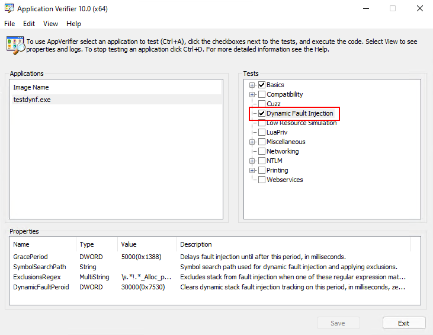

# Application Verifier Dynamic Fault Injection

`vfdynf.dll` is an application verifier provider that implements unique-stack 
based systematic fault injection to simulate low resource scenarios.



The integration also works with the command line (the `TEST` type is `DynFault`):
```
appverif DynFault ... -for TARGET ... [-with [TEST.]PROPERTY=VALUE ...]
```

"Dynamic Fault Injection" (DynFault) is a replacement for "Low Resource Simulation" 
(LowRes) tests. LowRes is a probability-based (randomized) fault injection. 
In contrast, DynFault tracks stack hashes when determining where to inject faults. 
This provides better coverage when simulating low resource scenarios. DynFault 
injects failures for wait, heap, virtual memory, registry, file, event, section, 
and OLE string APIs. These are the same APIs as LowRes.

The ability to exclude modules in LowRes is limited. DynFault, in contrast, enables
you to exclude stacks containing symbols matched by a set of regular expressions. 
Why is this helpful? I'll provide an example, which was the impetus for me reversing 
the undocumented parts of verifier to implement this library. 
[MSVC implemented debug iterators][msvc.dbgit] which are valuable to identify bugs but 
break `noexcept` contracts. For example, the default `std::string` constructor is marked 
`noexcept` but with debug iterators enabled an allocation could occur within it and throw 
an exception. The cpp exception handling then can't locate a handler past `noexcept`. The 
contract is such that if an exception would cross that boundary the implementation should 
terminate the program. Hopefully you can see the problem with the limited functionality 
of LowRes (you can't use it with debug iterators). To solve this DynFault has a 
property that allows you to define a list of regular expressions. When DynFault encounters 
a stack matching any expression in this list, that stack hash is excluded from fault 
injection. As an example, this regular expression tries to isolate stacks containing 
`std::basic_string`'s default constructor:

```
\s.*!.*_Alloc_proxy<.*>\s.*!std::basic_string<.*>::basic_string<.*>\s
```

The above regular expression will match on this stack:

```
testdynf.exe!heap_alloc_dbg_internal
testdynf.exe!heap_alloc_dbg
testdynf.exe!_malloc_dbg
testdynf.exe!malloc
testdynf.exe!operator new
testdynf.exe!std::_Default_allocate_traits::_Allocate
testdynf.exe!std::_Allocate<16,std::_Default_allocate_traits,0>
testdynf.exe!std::allocator<std::_Container_proxy>::allocate
testdynf.exe!std::_Container_base12::_Alloc_proxy<std::allocator<std::_Container_proxy> >
testdynf.exe!std::basic_string<char,std::char_traits<char>,std::allocator<char> >::basic_string<char,std::char_traits<char>,std::allocator<char> >
testdynf.exe!main
testdynf.exe!invoke_main
testdynf.exe!__scrt_common_main_seh
testdynf.exe!__scrt_common_main
testdynf.exe!mainCRTStartup
KERNEL32.dll!BaseThreadInitThunk
ntdll.dll!RtlUserThreadStart
```

Enabling the best of both worlds - debug iterators and fault injection!

## DynFault Properties (Options)

| Name               | Type        | Description |
| ----               | ----        | ----------- |
| GracePeriod        | DWORD       | Delays fault injection until after this period, in milliseconds. |
| SymbolSearchPath   | String      | Symbol search path used for dynamic fault injection and applying exclusions. |
| ExclusionsRegex    | MultiString | Excludes stack from fault injection when one of these regular expression matches the stack. |
| DynamicFaultPeriod | DWORD       | Clears dynamic stack fault injection tracking on this period, in milliseconds, zero does not clear tracking. |
| EnableFaultMask    | QWORD       | Mask of which fault types are enabled. Bit 1=Wait, 2=Heap, 3=VMem, 4=Reg, 5=File, 6=Event, 7=Section, 8=Ole. |
| FaultProbability   | DWORD       | Probability that a fault will be injected (0 - 1000000). |
| FaultSeed          | DWORD       | Seed used for fault randomization. A value of zero will generate a random seed. |

## Installation

At this time there is no installer/script to automate installation. Here are the instructions to 
manually install the library:

1. copy `vfdynf.dll` to `C:\Windows\System32` (or `SysWOW64` for x86 support on an x64 OS)
2. add `vfdynf.dll` to the "Application Verifier Global Settings" "Verified Providers" list (again `WOW6432Node` when appropriate)
    - `HKLM\SOFTWARE\Microsoft\Windows NT\CurrentVersion\Image File Execution Options\{ApplicationVerifierGlobalSettings}`
    - `VerifierProviders`

At this point `vfdynf.dll` is "registered" with application verifier and it should show up in the options 
via the command line or in the user interface.

## Building

The repo uses submodules, after cloning be sure to init and update the submodules. 
Project file are targeted to Visual Studio 2022.

```
git clone https://github.com/jxy-s/vfdynf
cd .\vfdynf\
git submodule update --init --recursive
MSBuild .\vfdynf.sln
```

## Credits

The following are used without modification. Credits to their authors.

- [Process Hacker Native API Headers][github.phnt]   
Collection of Native API header files. Gathered from Microsoft header files and 
symbol files, as well as a lot of reverse engineering and guessing.

[//]: # (Hyperlink IDs)
[github.phnt]: https://github.com/processhacker/phnt
[msvc.dbgit]: https://docs.microsoft.com/en-us/cpp/standard-library/debug-iterator-support?view=msvc-170

And, Grandfather Derpington ;)